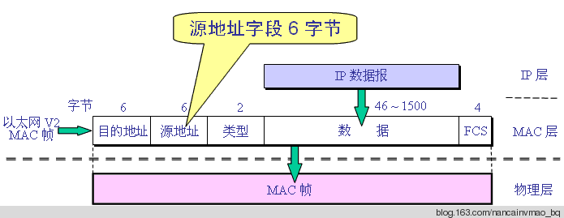
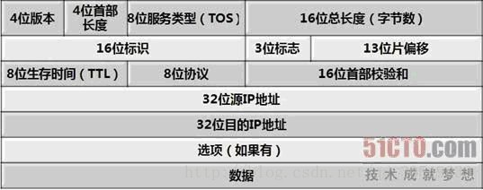
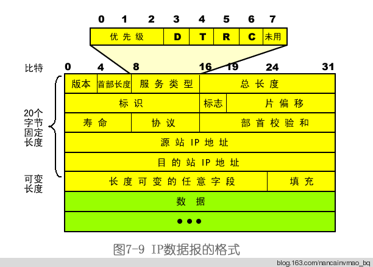
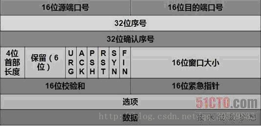

MAC帧头定义
---------------------------------
/数据帧定义，头14个字节，尾4个字节/
~~~
typedef struct _MAC_FRAME_HEADER
{
 char m_cDstMacAddress[6];    //目的mac地址
 char m_cSrcMacAddress[6];    //源mac地址
 short m_cType;       　　　　　//上一层协议类型，如0x0800代表上一层是IP协议，0x0806为arp
}__attribute__((packed))MAC_FRAME_HEADER,*PMAC_FRAME_HEADER;

typedef struct _MAC_FRAME_TAIL
{
 unsigned int m_sCheckSum;    //数据帧尾校验和
}__attribute__((packed))MAC_FRAME_TAIL, *PMAC_FRAME_TAIL;
~~~

其中类型字段，为2字节，用来标识上一层所使用的协议类型，如IP协议（0×0800）等。

数据字段，长度范围为46到1500，这是为什么呢？因为以太网包最小规定为64字节，不足的也会填充到64字节。而以太网帧格式的其他部分加起来是6+6+2+4=18字节，所以数据部分的最小长度为64-18=46字节；而以太网包的最大长度是1518字节，因此1518-18=1500字节。

最后的FCS字段是帧校验字段，即Frame Check Sequence，用来保存CRC校验值。

IP头
---------------------------------
/IP头定义，共20个字/
~~~
typedef struct _IP_HEADER 
{
 char m_cVersionAndHeaderLen;     　　//版本信息(前4位)，头长度(后4位)
 char m_cTypeOfService;      　　　　　 // 服务类型8位
 short m_sTotalLenOfPacket;    　　　　//数据包长度
 short m_sPacketID;      　　　　　　　 //数据包标识
 short m_sSliceinfo;      　　　　　　　  //分片使用
 char m_cTTL;        　　　　　　　　　　//存活时间
 char m_cTypeOfProtocol;    　　　　　 //协议类型
 short m_sCheckSum;      　　　　　　 //校验和
 unsigned int m_uiSourIp;     　　　　　//源ip
 unsigned int m_uiDestIp;     　　　　　//目的ip
} __attribute__((packed))IP_HEADER, *PIP_HEADER ;
~~~

如图，一个刻度表示1个二进制位（比特）。
1-1.版本4位，表示版本号，目前最广泛的是4=B1000，即常说的IPv4；相信IPv6以后会广泛应用，它能给世界上每个纽扣都分配
       一个IP地址。
1-2.头长4位，数据包头部长度。它表示数据包头部包括多少个32位长整型，也就是多少个4字节的数据。无选项则为5（红色部分）。
1-3.服务类型，包括8个二进制位，每个位的意义如下：
       过程字段：3位，设置了数据包的重要性，取值越大数据越重要，取值范围为：0（正常）~ 7（网络控制）
       延迟字段：1位，取值：0（正常）、1（期特低的延迟）
       流量字段：1位，取值：0（正常）、1（期特高的流量）
       可靠性字段：1位，取值：0（正常）、1（期特高的可靠性）
       成本字段：1位，取值：0（正常）、1（期特最小成本）
       保留字段：1位 ，未使用
1-4.包裹总长16位，当前数据包的总长度，单位是字节。当然最大只能是65535，及64KB。
2-1.重组标识16位，发送主机赋予的标识，以便接收方进行分片重组。
2-2.标志3位，他们各自的意义如下：
       保留段位(2)：1位，未使用
       不分段位(1)：1位，取值：0（允许数据报分段）、1（数据报不能分段）
       更多段位(0)：1位，取值：0（数据包后面没有包，该包为最后的包）、1（数据包后面有更多的包）
2-3.段偏移量13位，与更多段位组合，帮助接收方组合分段的报文，以字节为单位。
3-1.生存时间8位，经常ping命令看到的TTL（Time To Live）就是这个，每经过一个路由器，该值就减一，到零丢弃。
3-2.协议代码8位，表明使用该包裹的上层协议，如TCP=6，ICMP=1，UDP=17等。
3-3.头检验和16位，是IPv4数据包头部的校验和。
4-1.源始地址，32位4字节，我们常看到的IP是将每个字节用点（.）分开，如此而已。
5-1.目的地址，32位，同上。
6-1.可选选项，主要是给一些特殊的情况使用，往往安全路由会当作攻击而过滤掉，普联（TP_LINK）的TL-ER5110路由就能这么做。
7-1.用户数据。

任何一个IP数据报都是由首部和数据两部分组成，而且首部基本是固定长度的，长度为20字节。这一点很重要，其他都不记得了，这一点也要记得哦！

首部其实也分为两部分，即固定部分和可变部分，固定部分出的长度是20字节，可变部分的长度是可变的，但用的机会很少。

下面，我们就逐个域的来分析IP数据报：

 
【版本】- 4bit

用来标识IP协议的版本，最常见的就是4和6，分别代表IPv4和IPv6。

【首部长度】- 4bit

4bit所能表示的最大数值就是15了，而IP数据报标准规定，“首部长度”的单位是4字节（32bit），因此，我们在计算首部长度时，需要用其值乘以4字节，才是首部的实际长度。

可见，最大的首部长度是15×4=60字节，而最小的首部长度则是固定部分的长度，即20字节。

如果出现首部长度不是4字节的整数倍时，需要在最后一个字段加以填充，务必保证首部长度是4字节的整数倍。这样，我们的数据部分就总是从4字节的整数倍处开始。

【服务类型】- 8bit

此域常被称为TOS（Type Of Service），其中前3bit代表本数据报的优先级；D表示要求更低的时延；T表示要求更高的吞吐；R表示要求更高的可靠性；C表示要求选择代价更小的路由；第8个bit目前没有被使用。

上面这种分类方式，其实已很少应用，因为有时候这些要求的组合会使得调度策略产生矛盾，比如一条路由是高吞吐但不可靠，另一条是低吞吐但可靠，那么当用户同时要求T和R时，就会产生矛盾。因此，IETF组织将TOS重新进行了定义，称为DS（Differentiated Service），由于此标准只在特定环境特定设备中才有应用，所以就不在此赘述。

【总长度】- 16bit

此处的总长度是指首部长度和数据长度之和，单位仍然是字节。

16bit可以表示的最大值为65535，所以IP数据报的最大长度可以到达65535字节。但由于以太网的MTU(Maximum Transmission Unit)最大为1500字节，所以如果IP协议是运行在以太网的话，就会遇到需要分片的情况。

【标识】- 16bit

此域是一个计数器，所产生的值即为IP数据报的标识。当IP数据报的长度超过下层协议所规定的MTU的话，就要对IP数据报进行分片。在这种情况下，就是用这个域在表示同组的IP数据报的。

【标志】- 3bit

这3bit中只有前2bit有用，中间一位表示DF（don’t fragment），而最低位（最右侧的bit）表示MF（more fragment）。

DF等于1的话，表示此IP数据报“不能分片”。只有在DF等于0时，才允许对其进行分片。

MF等于1的话，表示此IP数据报后面还有分片的数据报，而MF等于0时，则表示当前的IP数据报是这一组中最后一个数据报。

【片偏移】- 13bit

此域表示当IP数据报超过MTU而被分拆成多片后，每一片在原IP数据报中的位置。此偏移量的参照起点是原数据报的数据部分的起点。

要注意的是，片偏移的单位是“8字节”，也就是说，每个分片的长度必须是8字节的整数倍。

【生存时间】- 8bit

此域也叫TTL（Time To Live），也可以叫做“寿命”。在IP数据报中是以“所经过的路由器跳数”来计算的。每经过一个路由器，此值都会减一，当TTL为0时，路由器便会丢弃该包。

默认情况下Linux的TTL为255，windowsXP为128，windows98为32，UNIX为255。

【协议】- 8bit

此域指出数据报携带的数据是使用了哪一种协议，大部分情况下TCP（值为6）或UDP（值为17）。

【首部校验和】- 16bit

此域是针对IP数据报的首部，进行校验。注意校验的只有首部，不包括数据部分。

【源站IP地址】- 32bit

即来源处的IP地址。

【目的站IP地址】- 32bit

即目的处的IP地址。

TCP
---------------------------------
/TCP头定义，共20个字节/
~~~
typedef struct _TCP_HEADER 
{
 short m_sSourPort;        　　　　　　// 源端口号16bit
 short m_sDestPort;       　　　　　　 // 目的端口号16bit
 unsigned int m_uiSequNum;       　　// 序列号32bit
 unsigned int m_uiAcknowledgeNum;  // 确认号32bit
 short m_sHeaderLenAndFlag;      　　// 前4位：TCP头长度；中6位：保留；后6位：标志位
 short m_sWindowSize;       　　　　　// 窗口大小16bit
 short m_sCheckSum;        　　　　　 // 检验和16bit
 short m_surgentPointer;      　　　　 // 紧急数据偏移量16bit
}__attribute__((packed))TCP_HEADER, *PTCP_HEADER;
~~~

TCP报文段也分为首部和数据两部分，首部默认情况下一般是20字节长度，但在一些需求情况下，会使用“可选字段”，这时，首部长度会有所增加。

下面，我们仍然延续讲解IP协议的思路，针对不同的域，分别进行讲解：

【源端口】- 16bit

来源处的端口号；

 

【目的端口】- 16bit

目的处的端口号；

【序号】- 32bit

每一个TCP报文段都会有一个序号，序号字段的值其实是本报文段所发送的数据的第一个字节的序号。这是因为TCP是面向连接的可靠服务，其每一个字节都会对应一个序号，通过序号来确保服务的可靠性和有序性。

【确认号】- 32bit

确认号，是期望收到对方的下一个报文段的数据的第一个字节的序号。（这句话有些拗口，但是在后面我们讲解三次握手和四次挥手时，大家会更深刻的理解这句话的含义）

【数据偏移】- 4bit

其实它本质上就是“首部长度”，因为“数据偏移”是指TCP报文段的数据部分的起始处距离TCP报文段的起始处的距离。（仍然很拗口，但相信你能明白）。

数据偏移总共占4bit，因此最大能表示的数值为15。而数据偏移的单位是“4字节”，此处的设计和IP数据报的设计是完全相同的，所以说TCP报文段首部的长度最长为15×4=60字节，且首部长度必须为4字节的整数倍。

【保留字段】- 6bit

这6bit在标准中是保留字段，我猜测，有两个目的，第一个是预留除URG/ACK/PSH/RST/SYN/FIN/之外的冗余功能位；第二个是为了对其字节位。

【紧急字段URG】- 1bit

此字段告诉系统此报文段中有紧急数据，应尽快传送。当URG=1时，

【确认字段ACK】- 1bit

当ACK=1时，表示确认，且确认号有效；当ACK=0时，确认号字段无效。

【推送字段PSH】- 1bit

当PSH=1时，则报文段会被尽快地交付给目的方，不会对这样的报文段使用缓存策略。

【复位字段RST】- 1bit

当RST为1时，表明TCP连接中出现了严重的差错，必须释放连接，然后再重新建立连接。

【同步字段SYN】- 1bit

当SYN=1时，表示发起一个连接请求。

【终止字段FIN】- 1bit

用来释放连接。当FIN=1时，表明此报文段的发送端的数据已发送完成，并要求释放连接。

【窗口字段】- 16bit

此字段用来控制对方发送的数据量，单位为字节。

一般TCP连接的其中一端会根据自身的缓存空间大小来确定自己的接收窗口大小，然后告知另一端以确定另一端的发送窗口大小。

【校验和字段】- 16bit

这个校验和是针对首部和数据两部分的。

【紧急指针字段】- 16bit

紧急指针指出在本报文段中的紧急数据的最后一个字节的序号。

UDP
---------------------------------
/UDP头定义，共8个字节/
~~~
typedef struct _UDP_HEADER 
{
 unsigned short m_usSourPort;    　　　// 源端口号16bit
 unsigned short m_usDestPort;    　　　// 目的端口号16bit
 unsigned short m_usLength;    　　　　// 数据包长度16bit
 unsigned short m_usCheckSum;    　　// 校验和16bit
}__attribute__((packed))UDP_HEADER, *PUDP_HEADER;
~~~

【UDP协议报头格式】

图已经很清晰，UDP报头要比TCP的简单许多，只有区区8个字节，即源端口、目的端口、用户数据报长度、校验和。就凭这一点，就比TCP那复杂的20字节报头，要轻便了许多。

此处唯一需要解释一下的，就是“用户数据报长度”，它占了16位bit，能表示的最大长度是2^16，单位是字节。这里所指的长度，是包含UDP报头在内的总长度，而非数据部分的长度。

【UDP数据报长度一般设置为多少比较合适】

在进行UDP编程的时候,我们最容易想到的问题就是,一次发送多少bytes好?    

首先,我们知道,TCP/IP通常被认为是一个四层协议系统,包括链路层,网络层,运输层,应用层.    

UDP属于运输层,下面我们由下至上一步一步来看:以太网(Ethernet)数据帧的长度必须在46-1500字节之间,这是由以太网的物理特性决定的.这个1500字节被称为链路层的MTU(最大传输单元).但这并不是指链路层的长度被限制在1500字节,其实这这个MTU指的是链路层的数据区.并不包括链路层的首部和尾部的18个字节.    

所以,事实上,这个1500字节就是网络层IP数据报的长度限制.    

因为IP数据报的首部为20字节,所以IP数据报的数据区长度最大为1480字节. 而这个1480字节就是用来放TCP传来的TCP报文段或UDP传来的UDP数据报的. 又因为UDP数据报的首部8字节,所以UDP数据报的数据区最大长度为1472字节. 这个1472字节就是我们可以使用的字节数。当我们发送的UDP数据大于1472的时候会怎样呢？这也就是说IP数据报大于1500字节,大于MTU.这个时候发送方IP层就需要分片(fragmentation).把数据报分成若干片,使每一片都小于MTU.而接收方IP层则需要进行数据报的重组.这样就会多做许多事情,而更严重的是,由于UDP的特性,当某一片数据传送中丢失时,接收方便，无法重组数据报.将导致丢弃整个UDP数据报。    

因此,在普通的局域网环境下，我建议将UDP的数据控制在1472字节以下为好. 进行Internet编程时则不同,因为Internet上的路由器可能会将MTU设为不同的值. 如果假定MTU为1500来发送数据的,而途经的某个网络的MTU值小于1500字节,那么系统将会使用一系列的机制来调整MTU值,使数据报能够顺利到达目的地,这样就会做许多不必要的操作.鉴于Internet上的标准MTU值为576字节,所以我建议在进行Internet的UDP编程时.最好将UDP的数据长度控件在548字节(576-8-20)以内.
