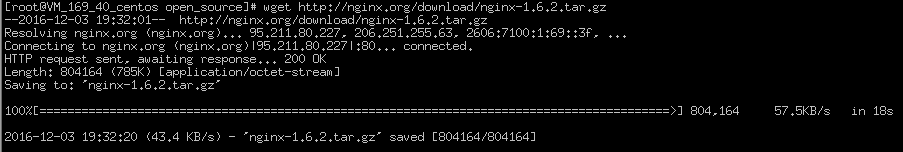
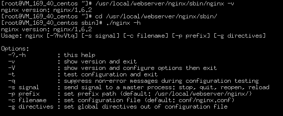
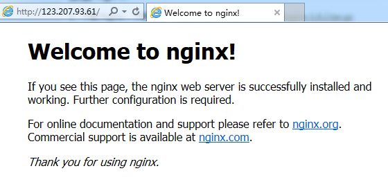

nginx安装
=====================================

- 下载ningx

    wget [http://nginx.org/download/nginx-1.6.2.tar.gz](http://nginx.org/download/nginx-1.6.2.tar.gz)
    
    
    
- tar -zxvf nginx-1.6.2.tar.gz
- cd nginx-1.6.2.tar.gz
- ./configure --prefix=/usr/local/webserver/nginx --with-http_stub_status_module --with-http_ssl_module
- make
- make install
- 查看版本及命令行

    
- ./nginx 
- 在浏览器输入地址

    
- 安装结束

配置demo
=====================================
所有配置正则表达式\.php的请求url均会使用如下配置信息
---------------------------------------------------------
    location ~ \.php$ {
        root           /data/running/web_html;
        fastcgi_pass   127.0.0.1:9000;
        fastcgi_index  index.php;
        #fastcgi_param  SCRIPT_FILENAME  /scripts$fastcgi_script_name;
        fastcgi_param  SCRIPT_FILENAME  $document_root$fastcgi_script_name;
        include        fastcgi_params;
    } 
	

开启浏览模式
---------------------------------------------------------
		location / {
			#autoindex on;
			autoindex_exact_size on;
			autoindex_localtime on;
	}
	
	